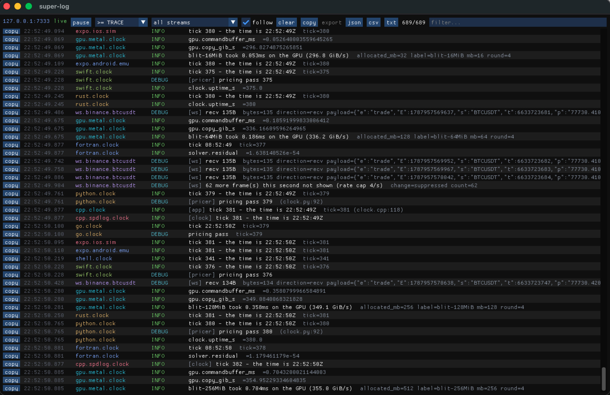
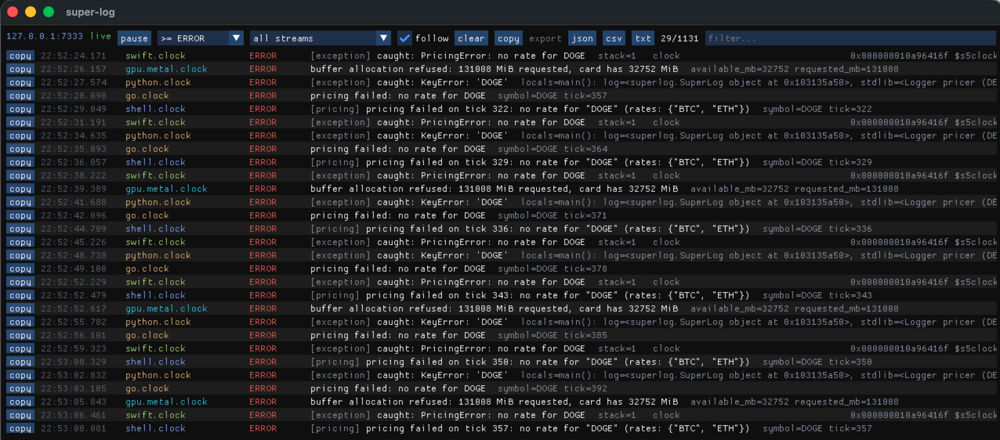
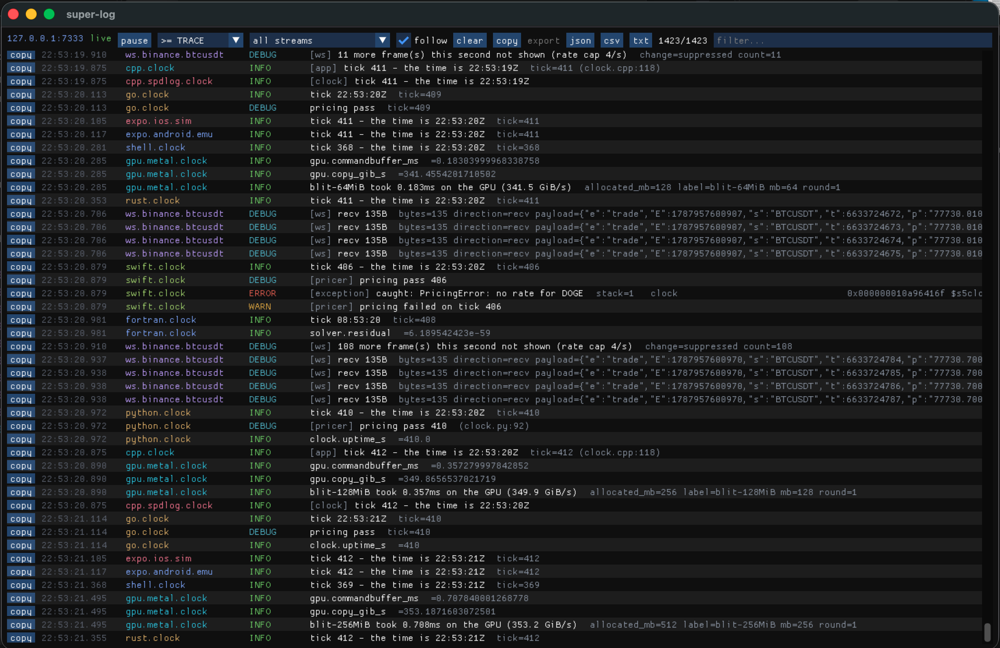

# super-log

[](https://github.com/saxonnicholls/super-log/actions/workflows/ci.yml)
[](LICENSE)
[](https://github.com/saxonnicholls/super-log/releases)

**One hub for every log stream you have — devices, servers, containers,
browsers, chains and apps.**



*Twelve producers on one screen, interleaved by arrival: C++ through both
SN_LOG and spdlog, Rust, Go, Python, Swift, Fortran, a POSIX shell script,
two React Native devices, Metal GPU work reporting real bandwidth, and a
live Binance WebSocket. The last of those is running at hundreds of frames a
second — so it is rate-capped, and says so rather than silently dropping
them.*

If you build across devices, you know the ritual: a Metro console for the
iOS simulator, another for the Android emulator, `adb logcat` for the phone
on your desk, a terminal for the C++ engine, another for the Rust service,
browser devtools for the web build, and an ssh session to the box in the
cloud. Six places to look, none agreeing on timestamps, and the bug is
always in the interleaving.

super-log converges all of it on one process and one screen:

```
 apps, 9 languages   ┐
 GPU and graphics    │
 devices and boards  │                                     ┌─▶ native viewer (ImGui)
 machines, services  ├── POST NDJSON ──▶  superlogd :7333 ─┼─▶ web viewer (React)
 network and DNS     │                    (fan-out+replay) ├─▶ journal → search / replay
 builds and repos    │                                     ├─▶ GET /recent  (scripts)
 blockchain          │                                     ├─▶ MCP tools    (agents)
 anything that prints┘                                     └─▶ alerts → webhook
```

| Group | What is in it |
|---|---|
| **apps** | C++ (spdlog sink and native `SN_LOG`), Rust (`tracing`), Python (`logging`), Go (`log/slog`), Java and Kotlin (`java.util.logging`), Swift, Fortran, POSIX `sh`, and JS for Node, the browser and React Native — where `console`, `fetch` and WebGL are captured too |
| **GPU and graphics** | Metal and CUDA kernel timings, WebGL context loss and shader failures, and the card itself through `nvidia-smi`, `rocm-smi` or `ioreg` |
| **devices and boards** | iOS and Android over USB, serial consoles reading ESP-IDF, Zephyr and bracketed formats, and ROS 2 `/rosout` |
| **machines, services** | OS logs on macOS, Linux and Windows; ~20 known services (postgres, nginx, redis, kafka…); Unity and Unreal Engine editor logs, level-parsed (Blender and AutoCAD by recipe); Docker containers; any remote host over ssh; power draw, thermals and top energy consumers (macOS); big downloads — a Hugging Face model, shard by shard — with stall alarms; other hubs, bridged whole |
| **network and DNS** | an HTTP/S logging proxy, WebSocket frames, a syslog and raw TCP/UDP inlet, DNS records with TLS expiry, and listening ports with their processes |
| **builds and repos** | cmake, clang, gcc, rustc, swiftc, npm, xcodebuild, Vivado and Quartus — plus sanitizer and valgrind findings captured whole, local git, and GitHub Actions |
| **blockchain** | watched addresses on any EVM chain, with transfers decoded and token decimals read per contract |
| **anything that prints** | `your-command 2>&1 \| superlog` — a drop-in `tee` |

Every producer speaks one small wire protocol
([docs/PROTOCOL.md](docs/PROTOCOL.md): one JSON event per line, batched over
plain HTTP POST), the hub fans out to any number of readers with
replay-on-connect, and everything is interleaved by hub sequence — not by
device clocks, which drift.

## What it does for you

**One screen, everything on it.** Streams colour-coded by source and level,
filtered by stream, minimum level or substring. Pause freezes the display
while collection continues; copy a row or the whole filtered view; export
JSON, CSV or plain text.



*The minimum level set to ERROR: 29 rows out of 1131. The same pricing
failure surfaces from Swift, Python, Go and a shell script side by side —
each in its own language's idiom, a `PricingError`, a `KeyError`, a returned
error, a shell test — plus the GPU refusing an allocation four times the size
of the card. Python's row carries the local variables from the failing frame,
which is the part you would otherwise be adding a print statement to find.*

**Your apps need almost nothing.** Nine dependency-free SDKs: header-only
C++ (both a **spdlog** sink and a native `snicholls::log` one), a Rust
crate with an optional `tracing` layer, Python plugging into stdlib
`logging`, Go with a `log/slog` handler, Java with a `java.util.logging`
bridge (and Kotlin), Swift, Fortran over raw POSIX sockets, a `sh`
one-liner for scripts, and one JS client for React Native, the browser and
Node — `patchConsole: true` and every `console.log` is on the bench.

Five of them hook the logging framework the language already has — the
spdlog sink, `logging.Handler`, `slog.Handler`, `java.util.logging.Handler`
and `patchConsole` — so everything a program *already* logs reaches the
bench without a single call site changing.



*Why the interleaving is the point. In the middle, one Swift tick unfolds in
order — the tick at INFO, a DEBUG pricing pass, the ERROR its exception
raised, and the WARN that followed — while eleven other producers keep
writing around it. Reconstructing that sequence from separate terminals is
the ritual this replaces.*

**Follow one action across every tier.** A tap becomes a request, a database
write and a chain call on four streams. `withTrace()` mints a correlation
id, carries it across `await`s, and puts it on outbound HTTP automatically;
a server adopts it and logs under the same id. Then one query — a `⇢` in the
viewer, `GET /recent?trace=…`, or an agent tool — returns the whole story in
order.

**Every error, including the ones nobody logged.** Uncaught exceptions and
unhandled rejections are captured by default in every SDK, with stacks —
chaining to whatever was already installed, so React Native still shows its
red box, Node still exits 1, and C++ still aborts. C++ traces are demangled
(`pricer::Engine::quote(int)`) with no boost dependency. For the hardest
class — an exception a library throws and your code catches and *displays* —
there is a render chokepoint pattern and an opt-in breadcrumb on every Error
construction.

**Zero-app-change fallbacks.** Host-side tailers scrape what already exists:
`adb logcat` (scoped to one app, because an OEM handset emits ~600 lines a
second), the iOS simulator's log stream, the macOS unified log, journald,
Docker containers, and any log file. A catalog knows where ~20 common
services log on macOS and Linux — postgres, mysql, mongodb, redis, nginx,
apache, kafka, elasticsearch, rocksdb — including both Homebrew prefixes.
The catalog also knows the engines and content tools: **Unity**'s
`Editor.log` (the C# compiler's `error CS1234` becomes ERROR, a thrown
exception too, while a folder named "Exceptions" stays INFO) and **Unreal
Engine**'s per-project editor logs (`LogNet: Warning:` maps by Unreal's own
verbosity words, category kept). Blender logs to stdout — that is what the
`tee` is for — and AutoCAD's `LOGFILEMODE` file tails like any other.

**Whole fleets, pulled over ssh.** One config file brings up every stream on
every server: OS logs, service logs, container logs. Nothing is installed
remotely, no port is opened, and the servers never need to reach the hub —
so the hub can stay loopback-bound while still watching production.

**HTTP calls, request and response.** Front a service with the logging proxy
and every call is one event (method, path, status, latency, size), or turn
on `patchNetwork` in the app and see the calls it makes. HTTPS targets need
no certificate work. Bodies are opt-in; credentials are always redacted.

**Blockchain addresses, beside the code that touched them.** Watch any EVM
address and its transfers, contract events and native balance moves land on
the same screen, in hub order, next to the app code that sent them.

**Infrastructure that only speaks when something changes.** DNS records and
TLS expiry, listening ports and the processes that own them — all watched by
diffing snapshots, so the stream is silent until it matters: an NS record you
did not change, a certificate three weeks out, a new public listener on a
production box, a service that restarted without saying so.

**Builds as events, not walls of text.** Wrap any build — cmake, clang, gcc,
cargo, npm, xcodebuild, local or over ssh — and compiler diagnostics become
WARN/ERROR rows with `file:line`, with one summary event carrying exit
status, duration and counts.

**Massive downloads, watched.** A 70B model from Hugging Face is fifteen
shards and half a day of `\r`-rewritten progress bars that exist only on the
terminal that started them — and tqdm, curl and wget all mute or reshape
those bars the moment their output is a pipe, so `tee` sees nothing. Wrap
the fetch in `superlog-dl` and percent, bytes and rate become metric events;
or point `--watch` at the destination directory and progress is measured at
the filesystem, which no tool can mute and which is the only honest
aggregate when every shard resets its own bar. The event that matters most
is the **stall**: no bytes for 30 seconds is a WARN on the bench — hours
before the fetch's own patience runs out at 97% of 140GB.

**Watts, thermals, and who is drawing them.** On macOS every bench run
samples CPU package power, die temperatures, fan RPM, aggregate CPU as one
number, and the top energy consumers — because a runaway process announces
itself through the fans long after a chart would have caught it (see the
`power` row below for the incident that earned this).

**History, not just the last few minutes.** The journal writes every frame
verbatim to disk; `search` reads it back with the same filters as the live
feed (including `--trace`), and `replay` re-publishes it at original pace.
A 1 GB / 4.8M-event journal searches in ~2.3 s.

**Readable by scripts and agents.** `GET /recent?since=<cursor>&level=ERROR`
answers "what happened since I last looked", with a cursor that never misses
or repeats an event.

**An MCP server, so a coding agent can read the bench.** Six tools, and the
shape of them matters: an agent's context is small and a firehose is not, so
every tool filters first, caps its output, and returns one compact line per
event.

| Tool               | For                                                                                      |
| ------------------ | ---------------------------------------------------------------------------------------- |
| `hub_status`     | Is the bench even up — "hub is down" vs "the app logged nothing"                        |
| `list_streams`   | Orientation: which topics are live, their level mix, which have errors                   |
| `tail_logs`      | Recent events by topic/level/text, with a cursor so repeat calls only return what is new |
| `search_logs`    | Find by text when you know the message but not the stream                                |
| `search_history` | The on-disk journal — hours or days, for "what happened at 3am"                         |
| `wait_for`       | Block until a matching event arrives, instead of sleeping and hoping                     |

```sh
npm run demo:mcp        # drives all six over stdio and prints what an agent sees
claude mcp add super-log --scope user -- node $PWD/sdk/js/packages/mcp/bin/superlog-mcp.mjs
```

Registered once per machine, not per project: one hub serves every project
and agents narrow by topic prefix. Read-only by construction, and
dependency-free — MCP over stdio is newline-delimited JSON-RPC 2.0.

**Something reaches you when nobody is watching.** Rules over the live feed
fire to a desktop notification, a webhook, a command, or back onto the bench
as `alert.*`. Three shapes, because production breaks in three ways:
something bad was logged, *too much* of it was logged, or something
**stopped** being logged — the last being the one most tools miss, since a
server with nothing to say and a server that is gone look identical until
you check. Rate and silence rules report recovery too.

**Producers never block.** Every SDK uses a bounded queue that drops oldest
under burst — counted, never hidden. A logger that can stall the app it
observes is worse than no logger.

**Off in production, by construction.** Every SDK requires you to declare
DEVELOPMENT or PRODUCTION (neither or both refuses to build), and each mode
ships only what its policy allows. Production defaults to **nothing**.

## What this is, and what it is not

**It is a development tool.** The bench you sit at: everything your machine
and your devices are saying, on one screen, in the order it happened, while
you are working. It is optimised for the ten seconds after something breaks
— one hub, no schema to declare, no agent to install, a stream added by
typing one command, and nothing to configure before the first line appears.

**It is not an observability suite, and should not be used as one.** The
distinction is not modesty, it is design: several things that make it good
at the first job make it unfit for the second.

|                         | super-log                                    | Prometheus / Grafana / Loki / Datadog |
| ----------------------- | -------------------------------------------- | ------------------------------------- |
| Lives                   | on your machine, while you work              | in production, permanently            |
| Retention               | a ring in memory, plus a journal you turn on | months, indexed, queryable            |
| Auth                    | **none** — loopback by default        | tenants, RBAC, audit                  |
| Scale                   | one bench, a handful of servers              | thousands of hosts                    |
| Alerting                | rules for "tell me while I am here"          | on-call, escalation, SLOs             |
| Cost of adding a stream | one command                                  | a pipeline change                     |

Concretely, do **not** point this at production and walk away. The hub has
no authentication: anyone who can reach the port can read every stream and
publish to any topic. It keeps 2000 events per topic in memory and forgets
the rest unless the journal is running. It has never been load-tested past
one bench and a handful of servers.

What it *is* fair to do in production is **pull**: the ssh tailer and the
fleet runner read remote logs onto your bench over ssh, so production never
needs to reach the hub and the hub never needs to be exposed. That is how
the fleet support is meant to be used.

**When you outgrow it**, you have not wasted anything — the wire format is
NDJSON on plain HTTP (see [docs/PROTOCOL.md](docs/PROTOCOL.md)), so a
forwarder into Loki, Elasticsearch or an OTLP collector is a small script
that subscribes to the firehose and re-posts. The two tools answer different
questions and it is reasonable to run both: this one for "what is happening
right now while I am looking", that one for "what happened last Tuesday at
three in the morning".

## Quick start

```sh
git clone --recurse-submodules --shallow-submodules <this repo>
cd super-log
cp .env.example .env             # optional: chain endpoints, hub defaults

# The whole demo: hub, C++/Rust/iOS/Android/browser/container clocks,
# OS-log streams, both viewers - one command
npm run demo                     # see demo/README.md for the tour

# ...and the other languages on the same screen, if their toolchains are here
SUPER_LOG_LANGS="go python java swift fortran shell" npm run demo

# Or piece by piece:
./scripts/dev.sh                 # build + run the hub
npm install && npm run viewer    # web viewer on http://localhost:7334
npm run tail:android             # first stream: the Android emulator
```

The demo binds to loopback. Real phones need the hub on the LAN:
`SUPER_LOG_LAN=1 ./demo/run.sh` — read the security section first. The
viewer finds the hub from the host that served the page, so opening it from
another machine needs no configuration.

## Installing it in a project

**Clone it once, use it from every project.** super-log is not a dependency
you add to a repo — it is a tool you install on a machine, like a debugger.
The hub is machine-wide and shared: one per bench, every project on it. Two
hubs would be two ports competing and two viewers each showing a third of
the picture.

That also keeps your repo clean, and it avoids a real cost — a Cargo git
dependency on this repo clones all five submodules and 36 MB of C++ that the
Rust crate never touches.

```sh
git clone --recurse-submodules --shallow-submodules \
  https://github.com/saxonnicholls/super-log ~/dev/super-log
cd ~/dev/super-log && npm install        # once, for the tailers and the web viewer
```

Then, per project:

```sh
~/dev/super-log/scripts/setup.sh ~/code/my-app
```

That writes exactly two files into your project and touches nothing else:

| File              | What                                             |
| ----------------- | ------------------------------------------------ |
| `superlog.conf` | what this project logs — the only file you edit |
| `logging.sh`    | a self-contained POSIX-sh launcher, ~250 lines   |

`.superlog/` (pids and logs) is added to your `.gitignore`. The project type
is detected, so the config arrives pre-filled rather than blank — a
`package.json` gets `npm run build`, a `CMakeLists.txt` gets
`cmake --build build -j`, and so on.

```sh
cd ~/code/my-app
$EDITOR superlog.conf     # topic prefix, dirs to watch, log files, services
./logging.sh start        # hub + viewer + this project's streams
./logging.sh status       # what is running, and where
./logging.sh stop         # stops what THIS project started - not the shared hub
```

**Booting it with your build and run** is the point of the last two
commands. They start the logging first if it is not already up, so wiring
them into what you already type is all it takes:

```sh
./logging.sh build        # your build, with its compiler diagnostics as events
./logging.sh run          # your program, output teed to the terminal AND the bench
```

`build` runs through the build wrapper, so warnings and errors arrive as
`WARN`/`ERROR` with `file:line`, and sanitizer or valgrind findings arrive
whole. `run` runs through `superlog-tee`, so stdout reaches your terminal
byte for byte and the bench at the same time. Either is a drop-in for the
command it wraps — `alias b='./logging.sh build'`, or `setup.sh --wire` to
add `npm run log` / `log:stop` / `log:status` to a Node project.

**Sharing one bench between projects works the way you would hope.** The
second project's `start` finds the hub and viewer already up and only adds
its own streams; each project's topics carry its own prefix, so they stay
separable in the viewer; and stopping one project leaves the others running.

If you would rather wire an SDK into your code directly instead of watching
from outside, that is the next section — but you do not have to, and for
most projects the launcher is enough to see everything.

## Putting your own apps on the bench

**React Native / browser / Node** (`@super-log/client`, zero dependencies):

```js
import { createSuperLog } from '@super-log/client';

const slog = createSuperLog({
  url: 'http://192.168.1.20:7333',   // your bench machine
  topic: 'expo.ios.device',          // topics name streams - PROTOCOL.md
  app: 'my-app',
  development: __DEV__,              // exactly one of these two, or it throws
  production: !__DEV__,
  patchConsole: true,                // console.* now reaches the bench
  patchNetwork: true,                // ...and every HTTP call it makes
});

// One id for everything this action causes, on every tier it reaches
await slog.withTrace(async () => {
  slog.info('checkout mounted', { user: '42' });
  await fetch('https://api.example.com/v1/pay');   // header added for you
});
```

React trees can wrap once with [`@super-log/react`](sdk/js/packages/react):
`<SuperLogProvider>` owns the client and an error boundary that logs the
**component stack** — which a global handler can never see, because React
swallows render errors.

**C++** (header-only; compile with `-DSUPERLOG_DEVELOPMENT` or
`-DSUPERLOG_PRODUCTION`):

```cpp
superlog::transport_config cfg;
cfg.topic = "cpp.pricer";
auto bat = std::make_shared<superlog::batcher>(cfg);   // before the logger

superlog::origin who;
who.app = "pricer";
spdlog::default_logger()->sinks().push_back(
    std::make_shared<superlog::spdlog_sink_mt>(bat, who));

superlog::install_terminate_handler(bat, who);  // uncaught exceptions + stack
```

**Python** (standard library only; `development=` / `production=`, exactly one):

```python
import logging, superlog

log = superlog.SuperLog(topic="python.pricer", app="pricer", development=True)

logging.getLogger().addHandler(log.handler())  # everything already logged
log.install_excepthook(capture_locals=True)    # and every crash, with locals

with log.traced():                 # ContextVars: async- and thread-safe,
    log.info("order received")     # and inherited by everything called inside
    stdlib_logger.debug("pricing") # ...including plain logging calls
```

Python gets two things the other SDKs cannot. `logging.Handler` means every
line the program *already* logs reaches the bench with no call-site changes.
And `capture_locals` attaches the local variables of the failing frames, so
an exception says `symbol='DOGE', n=7` rather than only where it happened —
secret-looking names are redacted and values truncated.

**Go** (a `log/slog` handler, so existing calls need no changes):

```go
log, _ := superlog.New(superlog.Config{
    Topic: "go.pricer", App: "pricer", Development: true,
})
defer log.Close()
slog.SetDefault(slog.New(log.SlogHandler(nil)))   // everything already logged

ctx, _ := superlog.WithTrace(context.Background(), "")
slog.InfoContext(ctx, "order received")           // ...on the tick's trace

go func() { defer log.Recover("worker"); work() }()  // panics, with stack
```

Trace lives in `context.Context` rather than a goroutine-local, because Go
deliberately has none — so the id travels exactly where the context does.
`Recover` logs the panic and re-panics: a logger that swallows a crash has
changed the program it was meant to observe.

**Java and Kotlin** (`java.util.logging` bridge; `InheritableThreadLocal`
trace, so a pooled task inherits its submitter's id):

```java
var log = SuperLog.builder().topic("java.pricer").app("pricer")
                  .development(true).build();
Logger.getLogger("").addHandler(log.julHandler());   // everything already logged
log.installUncaughtHandler();                        // and every crash

log.traceScope(() -> {
    log.info("order received");
    pool.submit(log.wrap(() -> log.debug("settled")));  // same trace
});
```

**Swift** (`@TaskLocal` trace, inherited by child tasks):

```swift
let log = try SuperLog(topic: "swift.pricer", app: "pricer", development: true)
try SuperLog.withTrace {
    log.info("order received")
    Task { log.debug("pricing pass") }   // same trace, nothing passed in
}
```

There is deliberately no `setTrace()`: a `TaskLocal` binds to a scope and
nothing else, which makes the usual leak — one request's id surviving into
the next — impossible to express rather than merely discouraged.

**Fortran** (raw POSIX sockets through `ISO_C_BINDING`, no libcurl):

```fortran
call sl_init(topic='fortran.solver', app='solver')
call sl_set_trace(sl_new_trace())
call sl_metric('solver.residual', residual)
if (residual /= residual) call sl_error('residual is NaN')
call sl_close()
```

A solver is the hardest program on the bench to observe: hours long, often
somewhere you cannot attach, and the evidence is a slurm file nobody reads
until the allocation is spent. `DEVELOPMENT` xor `PRODUCTION` is a
preprocessor error like the C++ SDK, and `SIGPIPE` is ignored at init so a
hub that goes away cannot kill a run twelve hours in.

**Shell** (any script, one line):

```sh
superlog-log --topic deploy "starting rollout"
tail -f /var/log/app.log | superlog-log --topic app.foo --level WARN
```

**Rust** (build with `--features development` or `--features production`):

```rust
let log = super_log::SuperLog::new(super_log::Config {
    topic: "rust.pricer".into(),
    app: "pricer".into(),
    ..Default::default()
});
log.install_panic_hook();                 // panics, with location
log.log(super_log::Level::Info, "engine up", None);
log.metric("fps", 58.9);
```

**Machines, services, containers, chains** (no app changes at all):

```sh
npm run tail:os -- --process MyApp          # this Mac's unified log
npm run tail:apps                           # what services log here
npm run tail:app -- postgres nginx redis    # ...then turn them on
npm run tail:app -- unity unreal            # engine editor logs, level-parsed
npm run tail:file -- /srv/app/production.log
npm run tail:ssh -- my-server               # a remote box, OS auto-detected
npm run tail:ssh -- db1 --app postgres      # ...or its postgres
npm run net -- 9000 http://localhost:3000   # every HTTP call through :9000
npm run grpc -- --listen 50052 --target localhost:50051  # every RPC, status from the trailer
npm run chain                               # watched addresses (see .env)
npm run dns -- example.com --once           # every DNS record + cert, then exit
npm run dns -- example.com mail.example.com # ...or watch them for change
npm run ports -- --once                     # what is listening, and which process
npm run ports -- --ssh web1 --procs nginx   # ...on a server, watched
npm run vitals -- --once                    # disk, memory, CPU, load
npm run vitals -- --ssh web1                # ...on a server, watched
npm run alert                               # rules from alerts.json
npm run alert -- --test                     # prove delivery without waiting
npm run build -- --label cxx -- cmake --build build -j
npm run build -- --label asan -- ./build/tests   # sanitizer findings, whole
npm run git                                 # this repo: commits, branches, conflicts
npm run git -- --ssh web1 --repo /srv/app   # ...a deployed checkout
npm run github -- --repo owner/name         # CI runs, PRs, releases
npm run watch -- --dir src                  # files created, modified, deleted
npm run watch -- --dir config --diff        # ...and the changed LINES, hunk by hunk
make 2>&1 | npx superlog --topic build.local # superlog-tee: a drop-in tee
npm run ws -- wss://stream.binance.com:9443/ws/btcusdt@trade
npm run serial -- --list                    # boards plugged in
npm run serial -- --port /dev/ttyUSB0       # the serial console, as events
npm run cf -- --worker my-api               # a Cloudflare Worker, live
npm run stripe -- --live --account acme     # payments, redacted by default
npm run socket -- --udp 5514                # syslog from routers, switches, NAS
npm run socket -- --tcp 5515                # ...or plain lines on a raw socket
npm run ros                                 # a robot's nodes, from /rosout
npm run ros -- --files                      # ...including past runs in ~/.ros/log
npm run gpu                                 # this machine's GPU, watched
npm run gpu -- --ssh trainer1               # ...or the box with the card in it
npm run power                               # watts, thermals, top energy hogs (macOS)
npm run power -- --once                     # one power reading, then exit
npm run bridge -- --ssh otherbench          # another hub's whole feed, into this one
npm run dl -- -- curl -LO https://host/model.safetensors   # a download, with progress
npm run dl -- --watch ~/models --size 140GB -- hf download org/model
npm run build -- --ssh web1 -- 'cd /srv/app && cargo build --release'
```

### Infrastructure watches

`dns` and `ports` diff a snapshot rather than streaming, so the first poll
is a silent baseline and only *changes* are reported — a watcher that
announces everything it sees teaches you to ignore it. The rest publish
readings as DEBUG `metric` events and raise their voice only on
edge-triggered crossings.

| Watch      | Publishes                                                                                        | Notable levels                                                                                                                                                                                                                                                                                                                                                                           |
| ---------- | ------------------------------------------------------------------------------------------------ | ---------------------------------------------------------------------------------------------------------------------------------------------------------------------------------------------------------------------------------------------------------------------------------------------------------------------------------------------------------------------------------------- |
| `dns`    | `dns.<domain>` — A, AAAA, NS, MX, TXT, CAA and the TLS certificate                            | **NS/CAA change is WARN** (you probably did not do it; it is how a domain gets taken), a record type vanishing is ERROR, certs go WARN at 3 weeks → ERROR at 1 → CRITICAL once expired. TXT changes are named by kind, so it says *"SPF/DMARC record changed"* rather than making you diff two long strings.                                                                   |
| `ports`  | `net.<host>.listeners` — listening sockets, owning process, pid, **and firewall rules** | A**new listener on a public address is WARN**, the same on loopback is INFO; a listener disappearing is WARN; a pid change is reported as a restart rather than as one service vanishing and another appearing; a watched process going missing is ERROR.                                                                                                                          |
| `vitals` | `host.<name>.vitals` — disk, memory, CPU and load, macOS/Linux/Windows                        | Readings are DEBUG`metric` events (always there for a chart, out of a default INFO view); threshold crossings are **edge-triggered** WARN/ERROR, so 85% says so once rather than every poll, and recovery says so too. Read-only filesystems are skipped: a macOS simulator runtime is 98% full by design, and alerting on it produced 25 false ERRORs before this rule existed. |
| `build`  | `build.<host>.<label>` — one event per diagnostic, one verdict                                | Compiler errors are ERROR with`file:line`; a build that **exits 0 while reporting errors** is WARN, not success, because that usually means a `;` where `&&` was meant — and a build that reports errors and calls itself fine is how a broken artefact ships.                                                                                                              |
| `power`  | `power.<host>` — CPU package watts, thermal pressure, fan RPM, CPU/GPU die temperatures, aggregate CPU as one number, and the top energy consumers attached to every sample; macOS | Exists because this machine sat at **1258% aggregate CPU** — eleven saturated cores, one VS Code extension — unnoticed until the fans got loud and kernel_task began throttling, and has crashed under runaway draw. "Too much" is machine-relative, so three detectors: absolute watt caps if you set them, sustained draw above the machine's own learned baseline, and the machine's own verdict (thermal pressure / CPU speed limit), which needs no tuning at all. Watts require root — `sudo scripts/install-power-tailer.sh` grants exactly one pinned powermetrics invocation, nothing else — and without root it still publishes thermals, aggregate CPU and top processes, each reading marked `power_unavailable: not root`. **The demo starts it unconditionally on macOS.** |
| `dl`     | `dl.<host>.<label>` — a download in flight: percent, bytes and rate as `metric` events, plus one verdict when it ends                                              | Built for the multi-hundred-gigabyte **Hugging Face** era: tqdm bars are `\r`-rewritten, mute themselves in pipes, and reset per shard, so beside reading the bar it can `--watch` the destination itself, which no tool can mute. A **stall** — no movement for 30s — is an edge-triggered WARN hours before the fetch's own patience runs out, and recovery says so too. A wrapper as transparent as `build`: same output, same stdin, same exit status. |

`dns` queries one chosen resolver (1.1.1.1 by default) so a change means the
record changed, not that a laptop moved networks and hit a different cache.
`build` is transparent: it prints the output and exits with the build's own
status, so it can sit inside a Makefile or a CI step unchanged.

`dl` wraps a fetch the way `build` wraps a compiler — output, stdin and
exit status untouched — and it exists for the downloads everyone now does:
pulling a large model or dataset from **Hugging Face**, shard by shard, for
hours.

```sh
npm run dl -- -- curl -LO https://huggingface.co/Qwen/Qwen2.5-7B/resolve/main/model-00001-of-00004.safetensors
npm run dl -- --watch ~/.cache/huggingface --size 140GB -- hf download meta-llama/Llama-3.1-70B
npm run dl -- --watch /data/corpus --size 100GB     # a fetch some other process owns
```

The first form reads the tool's own bar (tqdm/`hf`, curl's meter, wget, or
any bare `NN%`). The second is the one to reach for on a big multi-shard
pull: `hf download` runs one tqdm bar per shard and each resets to 0%, so
`--watch` measures the destination directory itself every tick —
symlink-aware, so a Hugging Face cache of blobs and snapshot links counts
each byte once — and `--size` turns that into the true overall percentage.
The third form needs no command at all: it follows a download some other
process owns, and exits when the size is reached.

## Whole fleets

Eight servers with containers each is thirty tailers, and nobody runs thirty
commands twice. Describe them once ([tailers/fleet.example.json](tailers/fleet.example.json)):

```json
{ "url": "http://127.0.0.1:7333",
  "hosts": [
    { "ssh": "web1", "name": "web1", "os": true, "apps": ["nginx"] },
    { "ssh": "deploy@10.0.1.20", "name": "api", "os": true,
      "identity": "~/.ssh/id_ed25519",
      "docker": ["api", "worker"], "files": ["/srv/app/log/production.log"] }
  ] }
```

`npm run fleet -- fleet.json` starts every stream and restarts any that die.
`name` is the topic name, so `os.api` reads better at 3am than
`os.ubuntu-4gb-nbg1-1`. Everything is **pulled** over ssh — no agent, no open
port, no route from production to the hub.

### Many benches: superlog-bridge

A hub rebroadcasts everything it ingests on `/ws`, so hubs compose:

```sh
npm run bridge -- --ssh otherbench
```

subscribes to another machine's **loopback** hub over an ssh tunnel and
re-ingests its whole feed here, verbatim — same topics, same bytes, so
nothing downstream can tell a bridged stream from a local one. Neither hub
ever listens on the network. One direction only: two hubs bridged at each
other is a feedback loop, so pick one bench to be *the* bench.

## History

```sh
npm run journal                                   # capture everything, rotated
npm run search -- --since 3d --level ERROR --topic node.
npm run search -- --trace 9f1c0a2b7d4e5f60        # one action, days later
npm run replay -- --dir superlog-journal --speed 1
```

The window filters on **hub arrival**, not the producer's clock: arrival is
monotonic, so the window is exact and the scan can stop early.

## Modes and policies

Every SDK enforces **DEVELOPMENT xor PRODUCTION** — neither or both is a
compile error (C++ and Fortran defines, Rust features) or a raised error
(JS, Python, Go, Java, Swift). Each mode
then ships what its *policy* allows: development everything, production
**nothing**. Want crash triage from release builds? Say so explicitly —
`-DSUPERLOG_PROD_POLICY=ERROR`, `prod_policy: Policy::AtLeast(Level::Error)`,
or `productionPolicy: 'ERROR'`. Below-policy events cost one compare; a
policy of OFF compiles the transport to an inert shell — and says so once on
the console, because a client that is silently doing nothing looks exactly
like a broken one.

Log lines leaving a production box are a security decision, so nothing here
makes it for you.

## Security posture

No auth, no TLS: anyone who can reach the port can read every stream and
publish to any topic. The defaults are arranged so exposure is a choice, not
an accident:

- **The hub binds loopback only**, demo or not; `SUPER_LOG_LAN=1` or `SUPER_LOG_BIND=0.0.0.0`
  open it up when real devices need it, on a network you trust.
- The ssh tailer and the fleet runner **pull**, so production logs reach the
  bench without production ever reaching the hub.
- Production builds forward nothing unless you loosened the policy.
- Credentials are redacted, not logged: `Authorization`, `Cookie` and
  `X-API-Key` headers in the proxy, token-shaped query values in URLs, and
  the provider key inside an RPC endpoint.
- `.env` is gitignored — an RPC URL with a key in it is spendable.
- CSV exports defuse spreadsheet formula injection; viewers render log
  content as text, never markup.

### SaaS and hosted services

The same idea, for the parts of a system you cannot attach a debugger to at
all. Both drive the vendor's own CLI, so there is nothing to install in your
service and no webhook to host.

**Cloudflare Workers**

```sh
npm run cf -- --worker my-api            # live, from now on
npm run cf -- --worker my-api --status error
```

Publishes to `cf.<worker>`. One invocation becomes several events sharing a
trace — the request, every `console` line the handler wrote, and any
exception — so `/recent?trace=…` returns one invocation end to end. Levels
come from the Worker rather than from guesswork: `console.error` is ERROR, a
500 is an error whether or not the handler said so, and an outcome that is
not `ok` is an error **even when nothing was logged** — `exceededCpu` kills
the isolate silently, which is exactly the failure you cannot see from
inside. CPU and wall time arrive as DEBUG metrics.

It uses `wrangler`'s own login, so no API token is needed. It is **live
only**: `wrangler tail` cannot reach backwards, and `--since` refuses with an
explanation rather than quietly tailing from now and letting you believe you
are looking at an hour ago.

**Stripe**

```sh
npm run stripe                                   # test mode, default account
npm run stripe -- --live                         # real money
npm run stripe -- --live --account acme --account beta
```

Publishes to `stripe.<account>.<mode>`, one process and one topic per
account, so a busy account cannot delay a quiet one. Levels follow what an
event *means*: a dispute is CRITICAL because it is money already gone plus a
deadline, a failed payment is ERROR, a refund or cancelled subscription is
WARN. Amounts arrive as a `stripe.amount` metric.

**Redacted by allowlist, and this is the point.** A
`payment_intent.payment_failed` carries the customer's email, name, phone,
full billing address, card brand, last four and fingerprint. That is a
customer record, not log data, and this hub has no authentication. Only
named fields ever leave the process — a blocklist would start leaking the
day Stripe adds a field. What survives is what you would actually debug
with: the decline code, the failure message, the amount, and the customer
*id*. `--unsafe-full` turns it off and warns you first.

Setup is the Stripe CLI's own:

```sh
stripe login                        # the default account
stripe login --project-name acme    # a second account, then --account acme
```

`stripe login` grants **test-mode** keys; `--live` needs an account
authorised for it. CLI keys also expire — if a stream goes quiet after a few
months, re-run `stripe login` before suspecting the tailer.

### Why there is no login

The bar this aims at is deliberately modest and deliberately explicit: **be
no less safe than the logs a developer already has**, and never more
dangerous than them.

Normal logs are files under `/var/log` and `~/Library/Logs`, `adb logcat`,
the Metro and Xcode consoles, `journalctl`. Every one of them is local-only,
enforced by the operating system, and none can be written to from another
machine. Bound to loopback, this is the same thing: the OS is the
authentication, and it is the same OS doing the same job it already does for
your log files. Adding a password on top of that protects nothing that was
not already protected.

So the honest answer to "shouldn't there be auth?" is that **for the case
this tool is actually used in, auth would be theatre**. What matters is not
adding a login; it is not quietly becoming reachable.

Two things follow, and they are the whole policy:

**The default is the safe one.** This was not always true. The hub used to
bind `0.0.0.0` while this file claimed exposure was "a choice, not an
accident" — true of the demo script, false of the binary these instructions
tell you to run. A security claim the code did not honour is worse than
either alone. It binds loopback now, and says so at startup, and says
something louder when it is not.

**A token would not fix the case people imagine it fixes.** Without TLS a
shared secret crosses the network in plaintext on every request, so anyone
who can sniff that network has it after one request and keeps it. It would
stop accidental access, not an attacker — while adding a real new leak,
because browsers cannot set headers on a WebSocket and the viewer's token
would have to travel in the URL, into browser history and `Referer` and
every pasted link. That is a poor trade for something the OS already does
properly one layer down.

### Devices, without opening anything

The one genuine gap is a phone pushing logs, because a handset cannot reach
loopback on your Mac. Use USB rather than the network:

```sh
adb reverse tcp:7333 tcp:7333          # Android - the phone's localhost is yours
iproxy 7333 7333                       # iOS, via libimobiledevice
```

That is parity with normal logs everywhere, with no new code and no open
port. It is also strictly better than a LAN bind with a token, and simpler.

### Containers, and other machines

**Docker on macOS needs nothing.** A container reaching
`host.docker.internal` arrives on the host's loopback, so the repo's own
Ubuntu producer keeps working against a loopback-bound hub — verified, not
assumed. The counter-intuitive part is that **`--network host` does not
work** on Docker Desktop: "host" there means the Linux VM, so the
container's `127.0.0.1` is the VM's and not your Mac's. The permissive-
sounding flag is the one that fails.

```yaml
extra_hosts: ["host.docker.internal:host-gateway"]   # what the compose file does
```

**Docker on Linux** is the other way round: `--network host` shares the
host's network namespace, so `127.0.0.1` in the container really is the
host's loopback and a loopback-bound hub is reachable directly.

Either way, **no GUI ever runs in the container** — so there is no X11
socket to mount and no Wayland or waypipe forwarding to configure. Only
HTTP crosses the container boundary; the viewer runs natively where your
eyes are. A Linux workload in Docker on a Mac is visualised by the native
macOS viewer, which is the hub/viewer split doing exactly the job it was
designed for.

**A Raspberry Pi, or any other machine**, is the phone problem again — it
cannot reach your loopback. Two answers, both already here and neither of
which opens a port:

```sh
# 1. Pull. Nothing runs on the Pi, nothing is installed, no port is opened.
npm run tail:ssh -- pi4                     # its OS logs
npm run gpu -- --ssh pi4                    # its GPU, temperature and throttling
npm run build -- --ssh pi4 -- make          # a build on it

# 2. Push, through the ssh connection you already have, if an SDK runs there.
ssh -R 7333:127.0.0.1:7333 pi4              # then SUPER_LOG_URL=http://127.0.0.1:7333
```

The pull model is the better default and the reason the fleet support exists:
logs travel *to* the bench over ssh, so the machine being watched never needs
to reach the hub and the hub never needs to be reachable. A reverse tunnel
covers the case where code on that machine wants to use an SDK directly — it
carries the traffic over the ssh session you already trust, and is verified
working against a real server.

### If you must expose it

If devices really must reach it over the network, put the allowlist where
allowlists belong — the firewall, not the application. An IP filter inside
the process is reimplementing `pf` or `nftables` badly, and it is defeated by
exactly the same attacker.

```sh
# macOS, /etc/pf.conf - only this handset may reach the bench
block in proto tcp to any port 7333
pass in proto tcp from 192.168.1.20 to any port 7333

# Linux, and you are probably already running it
ufw allow from 192.168.1.20 to any port 7333
ufw deny 7333
```

Then treat the bench as what it is: a development tool holding whatever your
machines are saying. If that includes production access logs, ssh
authentication failures or anything with a customer in it, the write side
matters as much as the read side — nobody can forge lines into `/var/log`
from across a network, and an open hub is the one place that stops being
true.

See the Auth/TLS section of [docs/ARCHITECTURE.md](docs/ARCHITECTURE.md).

## Requirements

- **Hub + viewers:** macOS or Linux (POSIX phase 1), a C++17 compiler,
  CMake ≥ 3.16. Windows machines join as producers (SDKs, ssh tailer).
- **Displays, on Linux:** the native viewer draws through GLFW, built here
  for X11 — which a Wayland desktop also runs via XWayland, so it should
  work there unchanged. Native Wayland output is a GLFW build switch
  (`-DGLFW_BUILD_WAYLAND=ON` plus the wayland/xkbcommon dev packages), not
  a code change. No Linux desktop has been on this bench, so treat the
  first run of either as bring-up; the **web viewer** needs only a browser
  and does not care what your compositor is.
- **JS:** Node ≥ 18 (≥ 22 for journal, chain watcher and MCP).
  **Rust:** any recent stable. **Python:** ≥ 3.8, standard library only.
  **Go:** ≥ 1.21 (`log/slog`). **Java:** ≥ 17, plain `javac`, no build tool.
  **Swift:** ≥ 5.9, SwiftPM. **Fortran:** gfortran or any compiler with
  `-cpp`. **Shell:** `sh` and `curl`, nothing else.
- On macOS, Go 1.21's internal linker omits `LC_UUID`, which current dyld
  rejects; build with `-ldflags=-linkmode=external` or use Go ≥ 1.22.
- [ts-moveables](https://github.com/saxonnicholls/ts-moveables) provides the
  transport/fan-out/logging fabric. It is **not** a submodule: CMake uses a
  sibling `../TSMoveables` checkout when one exists, and otherwise fetches a
  pinned SHA. Configure prints which of the two it chose, because a build
  quietly using someone's working copy is how "works on my machine" is made.
- spdlog + fmt, imgui + glfw, and nlohmann/json are pinned submodules in
  `third_party/` (`git submodule update --init`) — versions chosen to work
  together, so system-installed ones are never trusted.
- Docker (optional) for the Ubuntu build-and-smoke image.

## Layout

| Path              | What                                                                                                 |
| ----------------- | ---------------------------------------------------------------------------------------------------- |
| `hub/`          | `superlogd` - the one process everything meets at                                                  |
| `scripts/`      | `setup.sh` (add super-log to a project), `smoke.sh`, `verify-sdks.sh`, `dev.sh`              |
| `tests/`        | 100 tests: the tools driven as subprocesses against a real hub                                       |
| `sdk/cpp/`      | header-only: forward sink, spdlog sink, terminate handler                                            |
| `sdk/rust/`     | `super-log` crate: core, `tracing` layer, panic hook                                             |
| `sdk/python/`   | `superlog`: client, `logging` handler, excepthook, locals capture                                |
| `sdk/go/`       | `superlog`: client, `log/slog` handler, panic recovery                                           |
| `sdk/java/`     | `SuperLog`: client, `java.util.logging` bridge, Kotlin notes                                     |
| `sdk/swift/`    | `SuperLog`: client, `@TaskLocal` trace                                                           |
| `sdk/fortran/`  | `superlog.F90`: client over raw POSIX sockets                                                      |
| `sdk/js/`       | `@super-log/client`, `@super-log/react`, `@super-log/mcp`                                      |
| `tailers/`      | adb, simctl, OS logs, files, services, docker, ssh, fleet, chain, journal, search, replay, net proxy, power, downloads, hub bridge |
| `viewer/imgui/` | native viewer                                                                                        |
| `viewer/react/` | web viewer                                                                                           |
| `demo/`         | the multi-client clock demo: one command, whole bench                                                |
| `docker/`       | Ubuntu build+smoke image and the Linux bench producer                                                |
| `third_party/`  | pinned submodules                                                                                    |
| `docs/`         | PROTOCOL.md (the contract), ARCHITECTURE.md (the shape)                                              |

## Status, honestly

Most of this is **verified live** on a real bench, and where something is
merely written it is labelled as such. Verified: the hub, both C++ paths,
Rust, the JS client in a real Expo app on simulators and hardware plus a
real browser and Node, both viewers, the macOS and journald tailers, the adb
tailer against a physical handset, ssh streaming from cloud hosts, a fleet
of four servers, the chain watcher against Ethereum mainnet, search and
replay over a 1 GB journal, correlation across tiers, the error hooks in all
four SDKs, and the Docker image (which smoke-tests itself during
`docker build`).

Also verified since: the Go, Java, Swift, Fortran and shell SDKs against a
live hub; sanitizer and valgrind capture against real ASan/TSan/UBSan and
valgrind output; the git and GitHub watchers (the latter catching real
commits as they were pushed); the ROS tailer against genuine ROS 2 Jazzy
`/rosout`; the socket inlet against real syslog datagrams; the serial tailer
against a pty; and a 20-minute Binance soak that found the hub's replay ring
holding 66 MB for one topic — `leaks(1)` confirmed no leak, the ring was
bounded by chunk count rather than bytes, and it now peaks at 30 MB under
the same load.

And since then: the power tailer in full root mode on two real Macs (a
Mac Pro and a Ventura iMac), its wattage cross-checked against a hand-run
`powermetrics`; the hub bridge relaying a second machine's loopback hub
onto this bench byte for byte over ssh; and `superlog-dl` against both a
live curl transfer and a real 100 GB Hugging Face dataset fetch, watched
overnight from the machine next to it.

**CI is green on every job**, first run, which is worth stating precisely
because it verifies things this bench cannot. It builds from a clean
checkout on Linux under both gcc and clang and on **macOS arm64** (the bench
is x86_64), runs **ThreadSanitizer on Linux** where macOS's TSan is broken at
the runtime level, builds the hub with **no submodules at all**, runs the
POSIX shell producer inside **Alpine** with busybox ash, busybox awk and no
GNU `date`, and runs `verify-sdks.sh` — so every SDK is proved to actually
deliver events on a machine that is not the one they were written on.

Still **written but not verified**: the Windows event-log path (no Windows
machine here), the iOS-hardware tailer, Kotlin (no `kotlinc` here), Swift on
iOS, the serial tailer against real hardware at a real baud rate, the
**CUDA demo** (no NVIDIA GPU and no `nvcc` here — treat its first build as a
bring-up), gRPC against TLS and a real client library, and the OpenGL, D3D
and WebGPU snippets. Not built yet: viewer "load session" and metric
sparklines.

CI lives in `.github/workflows/ci.yml`; `scripts/smoke.sh` is the one smoke
test that CI, the Docker image and your terminal all run identically.

## Future directions

Deliberately not built yet, and the reasoning matters as much as the list:

- **A Grafana / Loki / OTLP forwarder.** The obvious ask is "integrate
  Grafana", and the answer is a *forwarder*, not integration. Teaching the
  hub to be a Prometheus target or a Grafana datasource would make it depend
  on an ecosystem it does not need and would blur the line drawn above —
  the hub's job is to be the thing you can point anything at in ten seconds.
  A forwarder respects that line: one more subscriber on the firehose that
  re-posts into Loki or an OTLP collector, in the same shape as every tailer
  here, so the bench stays a bench and the long-term store stays separate.
  It is a small script, and it is the right bridge for anyone who wants
  yesterday's logs in Grafana and today's on the bench.
- **Viewer "load session"** and metric sparklines — the journal can already
  be searched and replayed, but neither viewer can open a saved session
  directly.
- **A byte budget on the hub's replay ring**, which belongs in ts-moveables
  rather than here; until it lands, `SUPER_LOG_REPLAY_CHUNKS` bounds the
  ring by count instead. See the comment in `hub/src/main.cpp`.
- **Windows** as a first-class host for the hub and viewers. Windows
  machines already work as producers, and the event-log tailer is written
  but unverified.

## Contributing

This was built for my own bench and then it turned out to be useful, so here
it is. **Pull requests are welcome** — new streams especially: if something
on your desk emits logs and this cannot read it yet, that is the gap worth
filling.

Two things make a change easy to accept. Run it against a real hub before
you open the PR, and say in the description what you actually observed —
this repo's habit is to label what is verified and what is merely written,
and that habit is the reason it can be trusted. And keep the producer
contract: bounded queue, drop oldest, count what was dropped, and never
block the program you are observing.

Issues describing a stream you wish it read are useful too, even without a
patch.

### If you run a service that produces logs

**An open invitation.** If you build a SaaS product that emits logs, events
or metrics that developers debug against, a reader for it belongs here and
you are the person best placed to write it — you know the event shapes, the
severities that actually matter, and which fields are the ones people need
at three in the morning.

There are readers here for Cloudflare Workers, Stripe, GitHub Actions,
Postgres, nginx, Redis, Kafka, Docker, ROS and a couple of dozen others.
Every one of them is a single file of a few hundred lines that spawns your
CLI or calls your API and turns the output into events. There is no plugin
API to learn and no interface to implement — read one of them and you have
seen the whole pattern.

Three things a good one does, and they are the whole review:

**Levels mean what your product means.** Not what the event is called. A
Stripe dispute is CRITICAL because it is money already gone plus a deadline;
a Cloudflare Worker that exceeded CPU is an error even though it logged
nothing at all. You know which of your events are the three-in-the-morning
ones. Encode that, and a developer's level filter starts doing real work.

**Redact by allowlist, not blocklist.** This hub has no authentication and
is read by anyone who can reach it. A `payment_intent.payment_failed`
carries an email, a name, a phone number, a billing address and a card
fingerprint — that is a customer record, not log data. The Stripe reader
names the fields that may leave and drops everything else, because a
blocklist starts leaking silently the day you add a field. If yours carries
personal data, do the same.

**Keep the producer contract.** Bounded queue, drop oldest, count the drops,
and never block or kill the program being observed. A logger that can take
down the thing it is watching has no business being installed.

If that sounds like your product, open an issue or a PR — or just tell us
what the API is and we will have a go. Streams nobody has thought of yet are
the most interesting kind.

## Releases

Tagged releases carry notes saying what is verified and what is not —
[CHANGELOG.md](CHANGELOG.md). There is no package registry: the clone is the
distribution, so pin a tag if you want a stable base.

```sh
git clone --recurse-submodules --shallow-submodules --branch v0.1.0 \
  https://github.com/saxonnicholls/super-log ~/dev/super-log
```

## Licence

[MIT](LICENSE). Every source file carries the copyright line and an
`SPDX-License-Identifier: MIT`, so the licence travels with the file when
someone copies one out — which, for a repo made of self-contained
single-file tools, is how most of it will actually be reused.

Copyright 2026 Saxon Herschel Nicholls.
